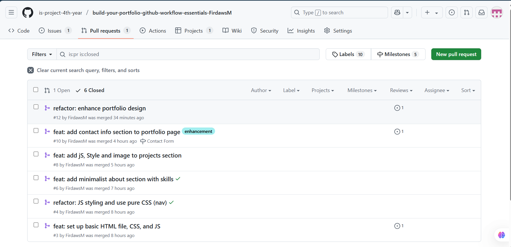

# Personal Portfolio Documentation

## 1. Student Details

- **Mohammed Firdaws Alnuur**:
- **138386**:
- **FirdawsM**:
- **firdaws.mohammed@strathmore.edu**:

## 2. Deployed Portfolio Link

- **[GitHub Pages URL](https://is-project-4th-year.github.io/build-your-portfolio-github-workflow-essentials-FirdawsM/)**:  
 

## 3. Learnings from the Git Crash Program

Write about **4 things** you expected to learn during the Git crash course (yes, we all came in with some big hopes 😅).
For each one, mention:

**1. Concept: Merge Conflicts**

**Expectation 👀:** I didn’t even know what a merge conflict was so I definitely wasn’t expecting to deal with one. I thought Git would just automatically know how to combine everything perfectly.

**Reality 😅:** I ran into a merge conflict while trying to merge two branches—one of which had changes I forgot I made directly on main. Git got confused, and so did I! I had to slow down and actually read the conflict markers to fix it manually.

**Impact 💡:** That experience taught me to commit more thoughtfully and double-check which branch I’m working on. I also became more careful with testing before merging—saving me from more headaches later in the project.

**2.  Concept: Commits**

**Expectation 👀:** I thought commits were just something you do occasionally to save your work, like hitting “Save” in a doc.

**Reality 😅:** Commits are like a journal of your progress. Writing meaningful messages actually helped me track what I changed and why.

**Impact 💡:** I used commits to track every major layout and content update in my portfolio site, and it saved me when I needed to roll back a design choice.

**3. Concept: Collaboration Tools (Pull Requests, Issues)**
**Expectation 👀:** I figured these were for big teams—something I wouldn’t need since I was working solo.

**Reality 😅:** Even on a solo project, I used pull requests to review changes before merging and opened issues to note bugs or ideas I wanted to revisit.

**Impact 💡:** It made my workflow more organized, and I felt like I was building something professionally—even when I was the only contributor.

**4. Concept: Git Workflow (Clone, Push, Pull)**

**Expectation 👀:** I thought I’d just be copying and pasting code into GitHub somehow.

**Reality 😅:** Cloning, pushing, and pulling became second nature—like muscle memory. Once I understood the flow, managing my code remotely felt smooth.

**Impact 💡:** I cloned my project onto a different computer and was able to keep working seamlessly, which made the whole portfolio process more flexible.
Example format:

## 4. Screenshots of Key GitHub Features

Include screenshots that demonstrate how you used GitHub to manage your project. For each screenshot, write a short caption explaining what it shows.

### A. Milestones and Issues  
  
*This screenshot shows a milestone I created for launching the portfolio site, with linked issues.*

### B. Project Board  
  
*GitHub Project Board with tasks organized into To Do, In Progress, and Done columns.*

### C. Branching  
  
*List of meaningful branches like `feature/about-section` and `fix/navbar-bug`.*

### D. Pull Requests  

*Closed pull requests linked to an issue.*

### E. Merge Conflict Resolution  
  
*Resolved merge conflict with clear commit message and safe merge into main.*

